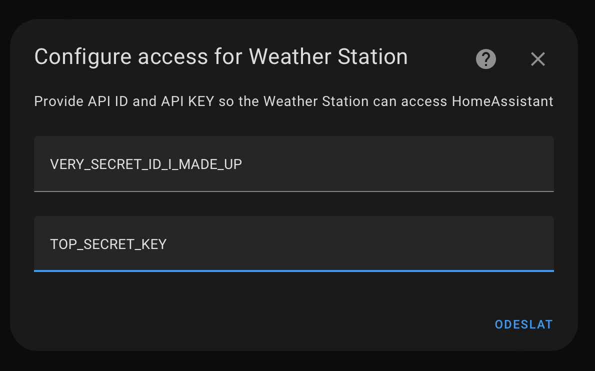
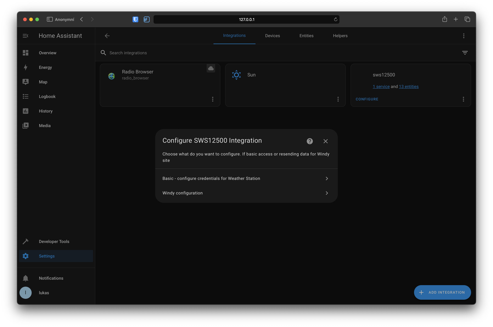
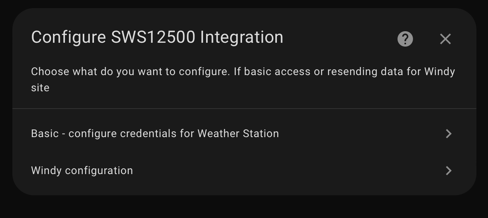
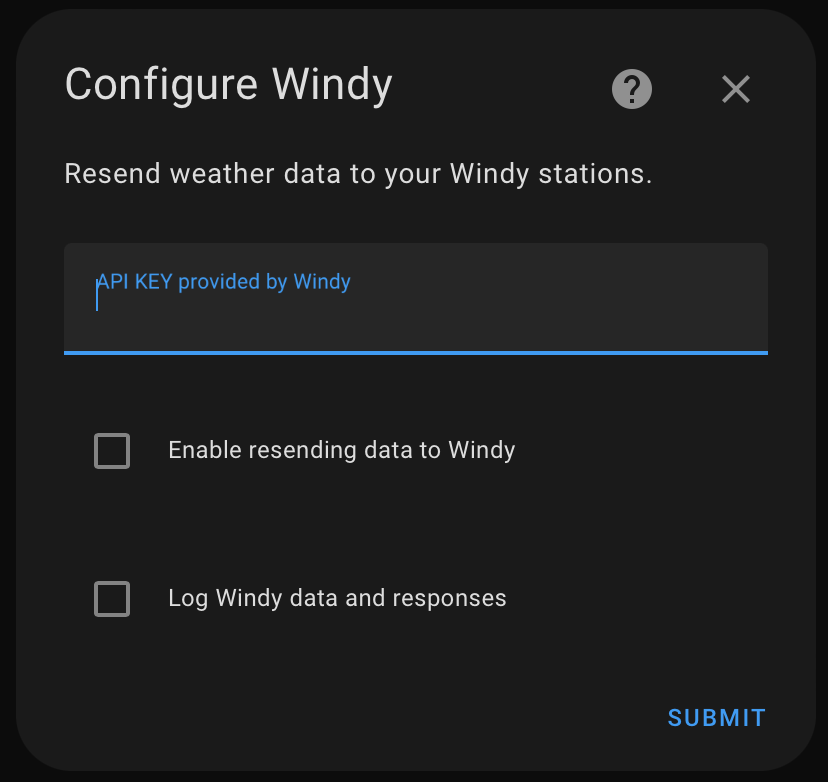

# Integrates your SWS 12500 weather station seamlessly into Home Assistant

This integration will listen for data from your station and passes them to respective sensors. It also provides the ability to push data to Windy API.

*This custom component replaces [old integration via Node-RED and proxy server](https://github.com/schizza/WeatherStation-SWS12500).*

## Requirements

- [Sencor SWS 12500 Weather Station](https://www.sencor.cz/profesionalni-meteorologicka-stanice/sws-12500).
- Configure station to send data directly to Home Assistant.
- If you want to push data to Windy, you have to create an account at [Windy](https://stations.windy.com).

## Installation

### If your station's firmware is 1.0 or your station is configured as described in this README and you still can not see any data incoming to Home Assistant please [read here](https://github.com/schizza/SWS-12500-custom-component/issues/17) and [here](firmware_bug.md)

### HACS installation
For installation with HACS, you have to first add a [custom repository](https://hacs.xyz/docs/faq/custom_repositories/).
You will need to enter the URL of this repository when prompted: `https://github.com/schizza/SWS-12500-custom-component`.

After adding this repository to HACS:
- Go to HACS -> Integrations
- Search for the integration `Sencor SWS 12500 Weather station` and download the integration.
- Restart Home Assistant
- Now go to `Integrations` and add new integration. Search for `Sencor SWS 12500 Weather station` and select it.

### Manual installation

For manual installation you must have an access to your Home Assistant's  `/config` folder.

- Clone this repository or download [latest release here](https://github.com/schizza/SWS-12500-custom-component/releases/latest).

- Copy the `custom_components/sws12500-custom-component` folder to your `config/custom_components` folder in Home Assistant.
- Restart Home Assistant.
- Now go to `Integrations` and add new integration `Sencor SWS 12500 Weather station`

## Configure your station in AP mode

1. Hold the Wi-Fi button on the back of the station for 6 seconds until the AP will flash on the display.
2. Select your station from available APs on your computer.
3. Connect to the station's setup page: `http://192.168.1.1` from your browser.
4. In the third URL section fill in the address to your local Home Assistant installation.
5. Create new `ID` and `KEY`. You can use [online tool](https://www.allkeysgenerator.com/Random/Security-Encryption-Key-Generator.aspx) to generate random keys. *(you will need them to configure integation to Home Assistatnt)*
6. Save your configuration.


Once integration is added to Home Assistant, configuration dialog will ask you for `API_ID` and `API_KEY` as you set them in your station:

```plain
API_ID: ID in station's config
API_KEY: PASSWORD in station's config
```



If you chanage `API ID` or `API KEY` in the station, you have to reconfigure integration to accept data from your station.

- In `Settings` -> `Devices & services` find SWS12500 and click `Configure`.
- In dialog box choose `Basic - Configure credentials`



As soon as the integration is added into Home Assistant it will listen for incoming data from the station and starts to fill sensors as soon as data will first arrive.

## Resending data to Windy API

- First of all you need to create account at [Windy stations](https://stations.windy.com).
- Once you have an account created, copy your Windy API Key.


- In `Settings` -> `Devices & services` find SWS12500 and click `Configure`.
- In dialog box choose `Windy configuration`.


- Fill in `Key` you were provided at `Windy stations`.
- Tick `Enable` checkbox.


- You are done.