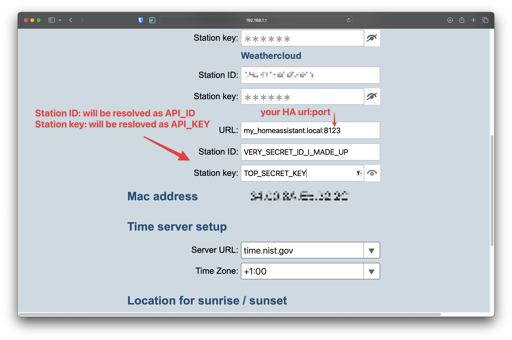
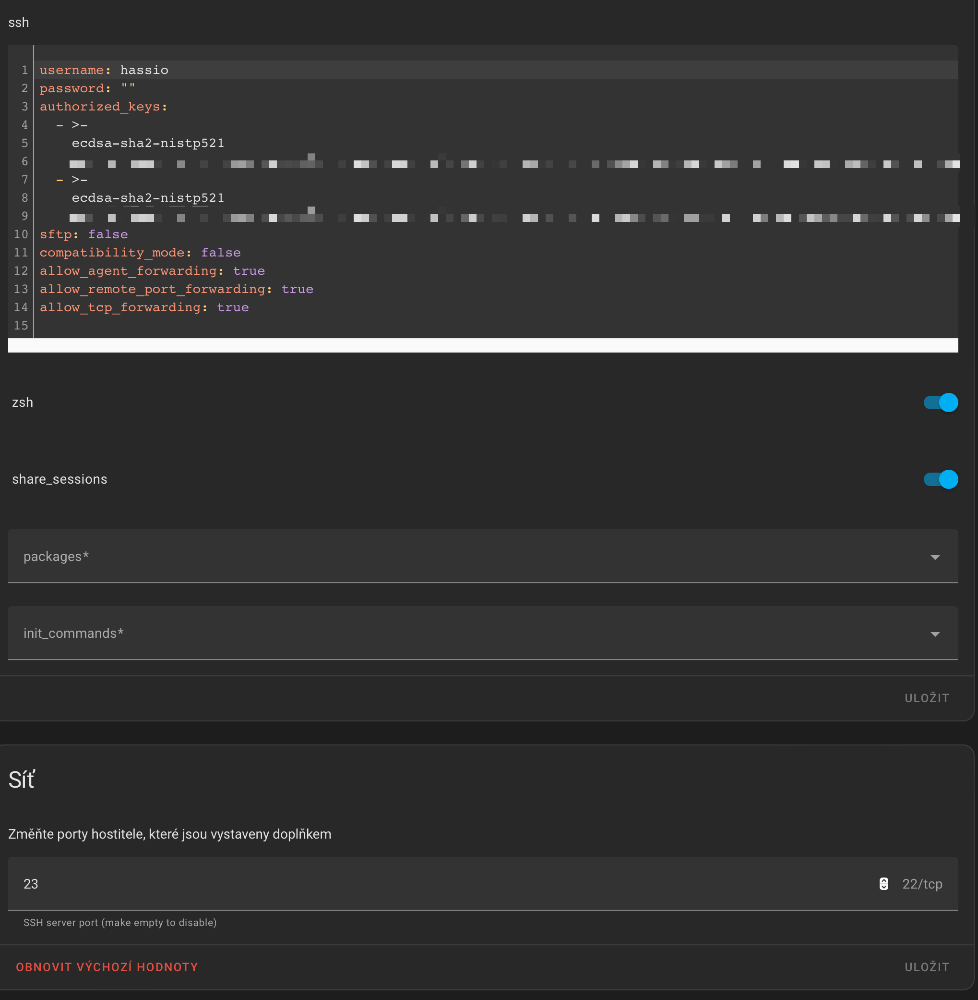

# :bug: Firmware version 1.0 bug

In station's `firmware 1.0` is a bug preventing data to be sent to Home Assistant.

This might be a problem even on firmwares > 1.0.


## :thinking: The issue

Once you have set an URL in station with port as `url:port`, the bug will cause that data will not be sent to the Home Station at all.



If you ommit the `:port`, station will send data to designated port `:80` of your URL.

## :adhesive_bandage: Workaround

[!TIP]
There is a solution to this! :bulb:

You have to redirect incoming data on `port 80` from station's IP address to `port 8123` or what ever port your instance of Home Assistant is running. To achive this, you have to run `iptables` to redirect ports.

Eg. `192.168.1.2.:any (station) -> 192.168:1.1:80 ---> 192.168.1.1:8123 (HA)`

So I provide a script that will handle this bug. But you must run this script every time you restarted Home Assistant, because `iptables` will not remain on reboot.

Ok, now how to do it?

### Step one

Install [`Advanced SSH & Web Terminal`](https://github.com/hassio-addons/addon-ssh/blob/main/ssh/DOCS.md) from add-ons. Yes, it **has to be** `Advanced SSH & Web Terminal` not regular `Terminal & SSH`, as regular `Terminal & SSH` do not have such functions, capabilities and privileges.

### Step two

After you have installed `Advanced SSH & Web Terminal` [configure ](https://github.com/hassio-addons/addon-ssh/blob/main/ssh/DOCS.md) it to run on some free port (eg. 23). Make sure you have configured `username` and `authorized_keys`. Please be advised, that this script will not work with `password`.



### Step three

Open `Web Terminal`. Copy and paste this command:

```
bash <(wget -q -O - https://raw.githubusercontent.com/schizza/SWS-12500-custom-component/main/install_iptables.sh)
```

This will download and run installation script of this workaround.
Follow the instructions in the script.

You will be asked for:

 * your station's IP
 * Home Assistant IP
 * Home Assistatn port
 * username in SSH addon (this is one you setup upon installation of the addon)
 * SSH port (also one you setup with the addon)


The scritp will set all you need to modify iptables on every Home Assistant start.

## :warning: Scrip will modify `configuration.yaml` so, please look at it and check that it does not contain any error.

### Step four

Script files are stored in your `config/iptables_redirect` directory.
There is also your public key for your SSH server configuration in `ssh` directory. It is important to add public key to your SSH server configuration.

So you are no all set! :tada:
